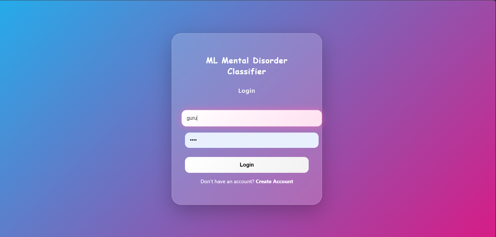
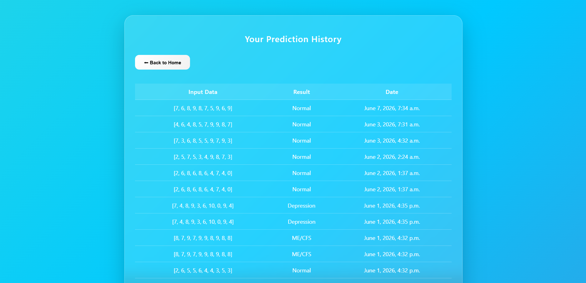

# Mental Health Prediction System

## Overview

The Mental Health Prediction System is a Machine Learning-based application developed to analyze health-related data and assist in identifying patterns associated with mental health conditions such as depression and ME/CFS (Myalgic Encephalomyelitis / Chronic Fatigue Syndrome).

This project aims to demonstrate the application of Artificial Intelligence and Machine Learning techniques in healthcare analytics.

---

## Features

* Data preprocessing and cleaning
* Machine Learning model training
* Mental health condition prediction
* User-friendly interface
* Performance evaluation and accuracy analysis

---

## Technologies Used

* Python
* Machine Learning
* Pandas
* NumPy
* Scikit-learn
* Matplotlib
* Django (if used)
* HTML/CSS

---

## Project Workflow

1. Data Collection
2. Data Preprocessing
3. Feature Selection
4. Model Training
5. Prediction Generation
6. Result Analysis

---
## Home Page

## Input Page

## Result Page

## History Page

---

## Installation

Clone the repository:

git clone <repository-url>

Move into the project directory:

cd mental-health-prediction-system

Install dependencies:

pip install -r requirements.txt

Run the project:

python manage.py runserver

---

## Future Improvements

* Deep Learning integration
* Real-time prediction system
* Improved dataset support
* Advanced visualization dashboard
* Enhanced prediction accuracy

---

## Applications

* Academic Research
* Healthcare Analytics
* Machine Learning Learning Projects
* Mental Health Awareness

---

## Author

Guru Kiran

Computer Science Engineering Student

Artificial Intelligence & Machine Learning Enthusiast
